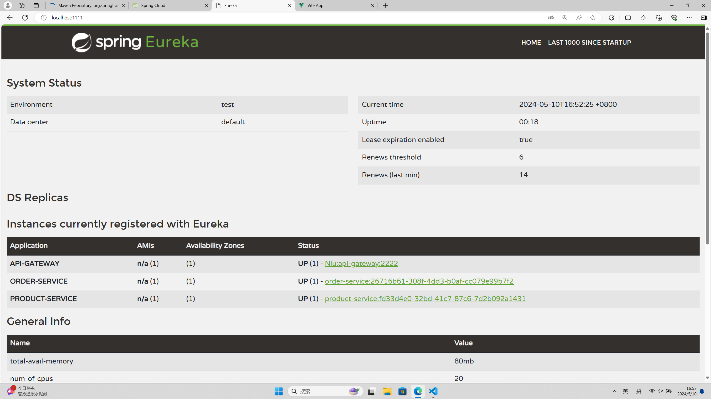

[](https://classroom.github.com/a/IMEm063v)
# Micro WebPoS 


请参考spring-petclinic-rest/spring-petclinic-microserivces 将webpos项目改为微服务架构，具体要求包括：
1. 至少包含独立的产品管理服务、订单管理服务以及discovery/gateway等微服务架构下需要的基础设施服务；
2. 请将系统内的不同微服务实现不同的计算复杂度，通过压力测试实验验证对单个微服务进行水平扩展（而无需整个系统所有服务都进行水平扩展）可以提升系统性能，请给出实验报告；
3. 请使用`RestTemplate`进行服务间访问，验证Client-side LB可行；
4. 请注意使用断路器等机制；
5. 如有兴趣可在kubernetes或者minikube上进行部署。

请编写readme对自己的系统和实验进行详细介绍。


1、自己重写了一下前端，并增加了gateway和discovery节点形成微服务架构。目前提供服务的有两个节点，一个管理商品，一个管理订单，购物车实现在前端。

项目结构：

```python
----
	--api 			#restful接口
	--picture		实验图片
    --spring-webpos-api-gateway gateway节点
    --spring-webpos-discovery-server ureka节点
    --spring-webpos-order 订单服务节点
    --spring-webpos-product 产品服务节点
    --vue-webpos-frontend 前端框架
```

演示视频在这里：https://www.bilibili.com/video/BV11t421u72W/

ureka节点的注册状态：


